 

### `01` About

Computer Science graduate building **AI-powered automation** and full-stack applications — currently interning at **Siemens**, wiring Python, React, Azure OpenAI and n8n into workflows that used to take humans hours. Off the keyboard: a *state-level cricketer* and a *Tabla Visharad*.

| CGPA | Sentiment Model | Shipped Projects | F1-Score |
|:---:|:---:|:---:|:---:|
| 8.38 / 10.0 | 81% accuracy | 2+ | 87.5% |

### `02` Where I've Worked

**Technical Intern** — Siemens Limited &nbsp;·&nbsp; Mar 2026 — Present

- Built AI-powered automation solutions with Python, React, Azure OpenAI, and n8n to automate enterprise workflows
- Developed AI applications combining LLMs, OCR, REST APIs, and Azure cloud services
- Designed and deployed full-stack applications with automated reporting and cloud integration
- Collaborated with cross-functional teams to deliver scalable enterprise solutions

`Python` `React` `Azure OpenAI` `n8n` `OCR`

 

| Education | Detail | Years | Score |
|---|---|:---:|:---:|
| MIT-ADT University | B.Tech, Computer Science Engineering | 2022–2026 | 8.38 CGPA |
| Patkar Varde College | HSC, Class XII — Goregaon | 2021–2022 | 65.33% |
| VPMS Vidya Mandir | SSC, Class X — Dahisar | 2019–2020 | 95.80% |

### `03` Selected Builds

<table>
<tr>
<td width="50%" valign="top">

**Sentiment Analysis for Product Reviews**

An NLP pipeline that reads raw product reviews and classifies sentiment — built with Python and classic ML, tuned through text preprocessing and feature engineering.

`81%` accuracy &nbsp;·&nbsp; `87.5%` F1 &nbsp;·&nbsp; shipped 2026
 
`Python` `NLP` `Pandas`

</td>
<td width="50%" valign="top">

**Detoxify — YouTube Feed Realignment Tool**

A full-stack web app that automates personalized YouTube playlist generation and content filtering, so your feed reflects what you want to watch — not what the algorithm wants.

`Full-stack` build &nbsp;·&nbsp; `API`-driven &nbsp;·&nbsp; shipped 2025
 
`Node.js` `Puppeteer` `YouTube API` `JavaScript`

</td>
</tr>
</table>

### `04` Tools of the Trade

Python · C++ · Java · JavaScript &nbsp;—&nbsp; HTML · CSS · React · SQL · MongoDB &nbsp;—&nbsp; n8n · Power Automate · Git · Power BI · Tableau · Excel &nbsp;—&nbsp; Azure OpenAI · Azure AI Document Intelligence · Azure Blob Storage

### `05` Beyond the Screen

**Mumbai State U-14 & U-16 Cricket** — represented Mumbai State, long before automation pipelines it was cover drives
 · 
**All India Inter-University Cricket** — represented MIT University
 · 
**Tabla Visharad** — formally trained and certified, rhythm and precision on and off the keyboard

### `06` GitHub Activity

### `07` Contact

Open to internships, full-time roles, and interesting problems in AI, automation, and full-stack engineering.

**[omkarambavkar12@gmail.com](mailto:omkarambavkar12@gmail.com)** &nbsp;·&nbsp; **[linkedin.com/in/omkar-ambavkar](https://linkedin.com/in/omkar-ambavkar)** &nbsp;·&nbsp; **[+91 93248 63013](tel:+919324863013)**

